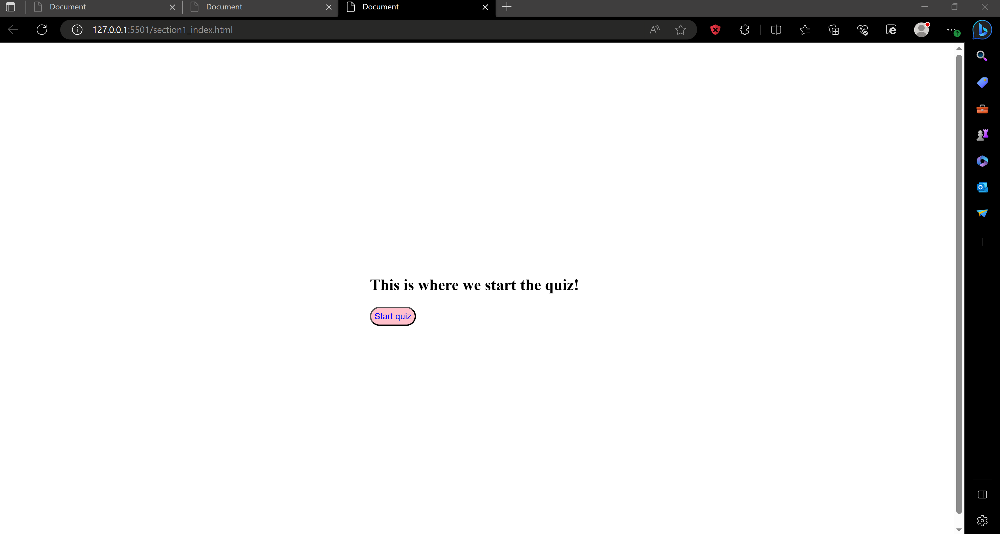

# Coding Assessment

## Description: 
A Javascript coding quiz with a timer and multiple choice answers. Includes dynamically updated html and css with a clean, polished, and responsive user interface.

## Screenshot:

## Link to App
[link](https://lwalker107.github.io/week4_codingbootcamp/)

## Tutor Help
This assignment I worked with tutor Chris Baird on the creation of the highscore page (lines 42-55 in HTML),
cleaning up my code because originally how I was doing it I created multiple html files for each page and Chris 
helped me slim it down to just one page and the use of javascript (lines 44-70 in Javascript), helped overall 
with the Javascript as I was having a hard time initially and helped with the creation of the timer (lines 104-110 in JS)